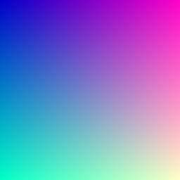

# What is raytracing?


# Getting started

## Outputting an image
Lets first output an image - the book reccomends using a ppm since you can just print to
stdout, but why should I when I can have the `bmp` crate already do it for me?

Lets just do a cheeky 
```cargo add bmp```

and steal the example code from the `bmp` page:

```
#[macro_use]
extern crate bmp;
use bmp::{Image, Pixel};

fn main() {
    let mut img = Image::new(256, 256);

    for (x, y) in img.coordinates() {
        img.set_pixel(x, y, px!(x, y, 200));
    }
    let _ = img.save("img.bmp");
}
```

A few things - I don't want the bmp macros, so I'll be deleting lines 1 and 2 and
replacing `px!(x, y, 200)` with a `Pixel::new()`. However, this
leads to a new issue where `(x, y)` are are a tuple of `u32`s, whereas if we look at the
constructor for `Pixel` [2], we will see that its defined as:

```pub struct Pixel {
    pub r: u8,
    pub g: u8,
    pub b: u8,
}```

The rust compiler (rightfully so) is unhappy about this... We're tossing in a u32 into a
function that takes in a u8, which would mean we lose 24 bits of precision when we cast
down! Rust sees this and decides to warn us, but if we explicitly cast the `u32 as u8`,
then the compiler stops complaining:

```
img.set_pixel(x, y, Pixel::new(x as u8, y as u8, 200));
```

Lets try running this with `cargo run`, and lo-and-behold: 

```
❯ cargo run
   Compiling rustracer v0.1.0 (/home/sw/git/rustracer)
    Finished `dev` profile [unoptimized + debuginfo] target(s) in 0.08s
     Running `target/debug/rustracer`
~/git/rustracer main* ⇡                                                    pyvenv 06:50:50 PM
```

Wonderful! Lets check out the image to see what it looks like:



But wait - we've glazed over a few things... We've informed the compiler that "yes, we do
want to lose 24 bits of precision", but we've never actually lost precision here - our
image here is `256x256`, and the largest value a u8 can store is also `256`! So what
happens if we cast and lose precision?

```
fn main() {
    let meow: u32 = 1365;
    let cast: u8 = meow as u8;

    println!("meow: {}, cast: {}", meow, cast);
}
```
```
meow: 1365, cast: 85
```

As expected, if we cast from a `u32` to a `u8`, it'll just trim off the top `24` bits!
Just to be sure, lets cast the two ints in python and see their outcomes:

```
❯ python
>>> bin(1365)
'0b10101010101'
>>> bin(85)
    '0b1010101'
>>>
```

Okay cool - we know casting behaviour now! Lets just move onto the next part

## The next part (vectors)

With graphics programming, we need vectors. If you don't know what a vector is, its just a
line in space with a direction (imagine its angle) and magnitude (how long it is).

In our case, our raytracer handles rays (which are just vectors) in three dimensions, so
we can just create a `struct Vec3` with helpful methods that makes life much easier for
us:
- `mag`(nitude) method
- overloading `mul` to be dot product
- overloading `add`
- overloading `sub`

### Creating the `Vec3` first!

Lets create a file in `src` called `vectors.rs`:
```
.
├── Cargo.lock
├── Cargo.toml
├── img.bmp
├── src
│   ├── main.rs
│   └── vectors.rs
├── tags
```

```
pub struct Vec3 {
    x: f64,
    y: f64,
    z: f64,
}

impl Vec3 {
    pub fn new(x: f64, y: f64, z: f64) -> Self {
        Vec3 {x, y, z}
    }
}
```

We've created our struct, with a way to initialise our `Vec3` with `Vec3::new(x, y, z)`.
Lets change main to match this:

```
mod vectors;

//use bmp::{Image, Pixel};
use vectors::Vec3;

fn main() {
    let myvec = Vec3::new(3.0, 3.0, 3.0);
    println!("mag: {}", myvec.mag());

    /*
   let mut img = Image::new(256, 256);

    for (x, y) in img.coordinates() {
        img.set_pixel(x, y, Pixel::new(x as u8, y as u8, 200));
    }
    let _ = img.save("img.bmp");
    */
}
```

### overloading add

```
mod vectors;

//use bmp::{Image, Pixel};
use vectors::Vec3;

fn main() {
    let v1 = Vec3::new(3.0, 3.0, 3.0);
    let v2 = Vec3::new(1.0, 2.0, 3.0);
    println!("v1: {}, v2: {}", v1, v2);

    let v3 = v1 + v2;
    println!("v3: {}", v3);


    /*
   let mut img = Image::new(256, 256);

    for (x, y) in img.coordinates() {
        img.set_pixel(x, y, Pixel::new(x as u8, y as u8, 200));
    }
    let _ = img.save("img.bmp");
    */
}
```

# Referneces
1. https://raytracing.github.io/books/RayTracingInOneWeekend.html     
2. https://docs.rs/bmp/latest/bmp/struct.Pixel.html    
